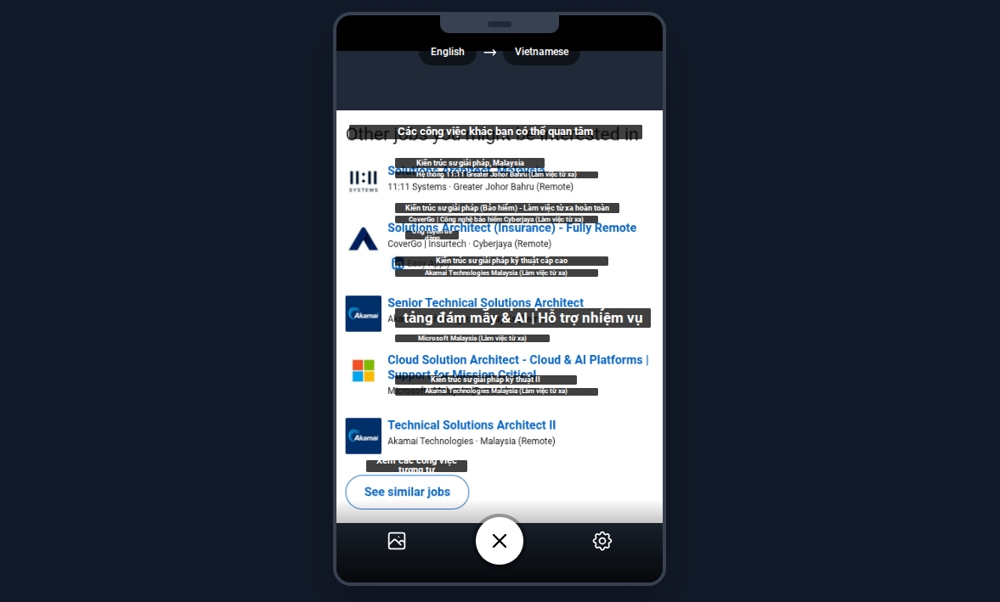

<div align="center">
<!--  -->

</div>

# Gemini Live Translator - A Demo App

Features:

- A user capture or upload a photo for language detection and translation.
- The translated text will be displayed onto an overlay above the original text (z-index).

## Document

- [Bounding box detection - Vertex AI > Generative AI on Vertex AI > Guides](https://docs.cloud.google.com/vertex-ai/generative-ai/docs/bounding-box-detection).

## Run the app

### Run Locally

**Prerequisites:**  Node.js

1. Install dependencies: `npm install`
2. Set the `GEMINI_API_KEY` in [.env.local](.env.local) to your Gemini API key.
3. Run the app: `npm run dev`

## The Technical Part

- For more details, please refer to the source code [`services/geminiService.ts`](services/geminiService.ts).

### JSON format structured response

- This is the most important part.
- This askes Gemini to return bounding box (bounds) of the original text (x-index/y-index).

```typescript
const responseSchema = {
    type: Type.ARRAY,
    items: {
        type: Type.OBJECT,
        properties: {
            originalText: {
                type: Type.STRING,
                description: "The original text detected in the image.",
            },
            translatedText: {
                type: Type.STRING,
                description: "The English translation of the original text.",
            },
            bounds: {
                type: Type.OBJECT,
                description: "The bounding box of the text as percentages.",
                properties: {
                    x: { type: Type.NUMBER, description: "Percentage from the left edge." },
                    y: { type: Type.NUMBER, description: "Percentage from the top edge." },
                    width: { type: Type.NUMBER, description: "Width as a percentage." },
                    height: { type: Type.NUMBER, description: "Height as a percentage." },
                },
                required: ["x", "y", "width", "height"],
            },
        },
        required: ["originalText", "translatedText", "bounds"],
    },
};
```

### Prompt

```typescript
export const translateTextInImage = async (
    base64Image: string,
    sourceLang: string,
    targetLang: string
): Promise<TranslatedText[]> => {
    const sourceLangName = getLangName(sourceLang);
    const targetLangName = getLangName(targetLang);

    const prompt = `Analyze the image to find all distinct text blocks. The original text is in ${sourceLangName}. For each block, provide:
1. The original text detected.
2. A translation of the text into ${targetLangName}.
3. The bounding box coordinates (x, y, width, height) as percentages of the total image dimensions. 'x' is the percentage from the left edge, and 'y' is the percentage from the top edge.
Ensure your response strictly adheres to the provided JSON schema. If no text is found, return an empty array.`;
```

## TODO

- A lot. Please refer to the [TODO](TODO.md) file.

## Contact

- Drop me an email or reach out to me on Google Chat ([chat.google.com](https://chat.google.com)): [`xuansam@google.com`](mailto:xuansam@google.com).


